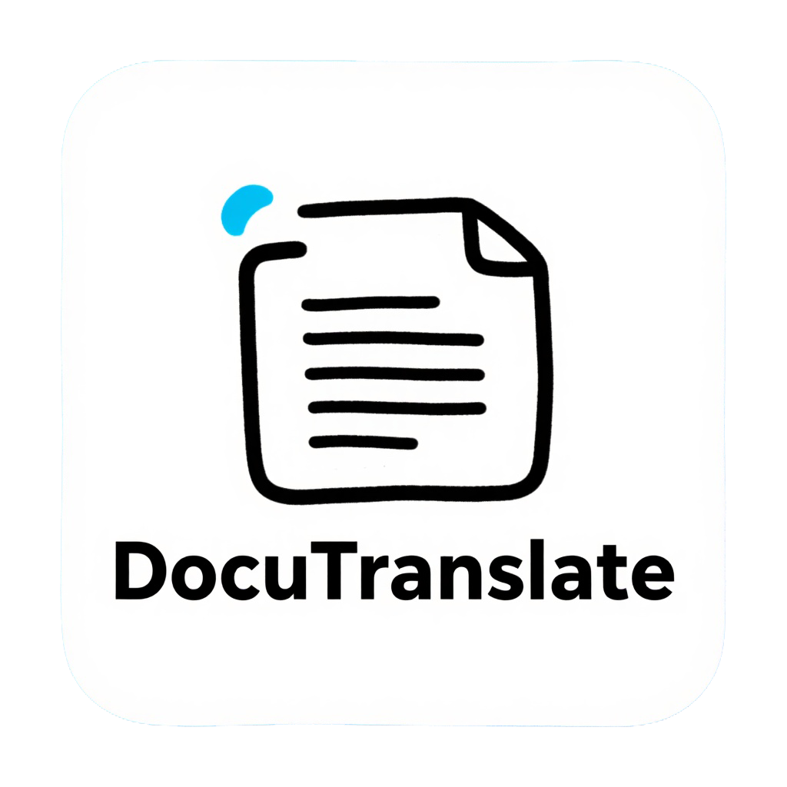

<p align="center">

</p>

<h1 align="center">DocuTranslate</h1>

<p align="center">
  <a href="https://github.com/xunbu/docutranslate/stargazers"></a>
  <a href="https://github.com/xunbu/docutranslate/releases"></a>
  <a href="https://pypi.org/project/docutranslate/"></a>
  <a href="https://www.python.org/"></a>
  <a href="./LICENSE"></a>
</p>

<p align="center">
  <a href="/README_ZH.md"><strong>简体中文</strong></a> / <a href="/README.md"><strong>English</strong></a> / <a href="/README_JP.md"><strong>日本語</strong></a>
</p>

<p align="center">
  A lightweight local file translation tool based on Large Language Models.
</p>

- ✅ **Support Multiple Formats**: Translates `pdf`, `docx`, `xlsx`, `md`, `txt`, `json`, `epub`, `srt`, `ass`, and more.
- ✅ **Auto-Generate Glossary**: Supports automatic glossary generation to ensure term alignment.
- ✅ **PDF Table, Formula, Code Recognition**: Leverages `docling` and `mineru` PDF parsing engines to recognize and translate tables, formulas, and code often found in academic papers.
- ✅ **JSON Translation**: Supports specifying values to translate within JSON using paths (`jsonpath-ng` syntax).
- ✅ **Word/Excel Format Preservation**: Supports `docx` and `xlsx` files (currently does not support `doc` or `xls`) while maintaining original formatting.
- ✅ **Multi-AI Platform Support**: Supports most AI platforms, allowing for high-performance concurrent AI translation with custom prompts.
- ✅ **Async Support**: Designed for high-performance scenarios, providing full asynchronous support and interfaces for parallel multi-tasking.
- ✅ **LAN & Multi-user Support**: Supports simultaneous use by multiple users within a local area network (LAN).
- ✅ **Interactive Web Interface**: Provides an out-of-the-box Web UI and RESTful API for easy integration and usage.
- ✅ **Compact, Portable Packages**: Windows and Mac portable packages under 40MB (versions that do not use `docling` for local PDF parsing).

> When translating `pdf`, it is first converted to markdown. This will **lose** the original layout. Users with strict layout requirements should take note.

> QQ Community Group: 1047781902

**UI Interface**:


**Paper Translation**:


**Novel Translation**:


## Integration Packages

For users who want to get started quickly, we provide integration packages on [GitHub Releases](https://github.com/xunbu/docutranslate/releases). simply download, unzip, and enter your AI platform API-Key to start using it.

- **DocuTranslate**: Standard version. Uses the online `minerU` engine to parse PDF documents. Choose this version if you do not need local PDF parsing (Recommended).
- **DocuTranslate_full**: Full version. Includes the built-in `docling` local PDF parsing engine. Choose this version if you need to parse PDFs locally.
> Version 1.5.1 and later support calling a locally deployed mineru service.

## Installation

### Using pip

```bash
# Basic installation
pip install docutranslate

# If you need to use docling for local PDF parsing
pip install docutranslate[docling]
```

### Using uv

```bash
# Initialize environment
uv init

# Basic installation
uv add docutranslate

# Install docling extension
uv add docutranslate[docling]
```

### Using git

```bash
# Initialize environment
git clone https://github.com/xunbu/docutranslate.git

cd docutranslate

uv sync

```

### Using docker

```bash
docker run -d -p 8010:8010 xunbu/docutranslate:latest
# docker run -it -p 8010:8010 xunbu/docutranslate:latest
# docker run -it -p 8010:8010 xunbu/docutranslate:v1.5.4
```

## Core Concept: Workflow

The core of the new DocuTranslate is the **Workflow**. Each workflow is a complete end-to-end translation pipeline designed for a specific file type. Instead of interacting with a massive class, you select and configure a suitable workflow based on your file type.

**The basic usage flow is as follows:**

1.  **Select Workflow**: Choose a workflow based on your input file type (e.g., PDF/Word or TXT), such as `MarkdownBasedWorkflow` or `TXTWorkflow`.
2.  **Build Configuration**: Create the corresponding configuration object for the selected workflow (e.g., `MarkdownBasedWorkflowConfig`). This configuration object contains all necessary sub-configurations, such as:
    *   **Converter Config**: Defines how to convert the original file (e.g., PDF) to Markdown.
    *   **Translator Config**: Defines which LLM, API-Key, target language, etc., to use.
    *   **Exporter Config**: Defines specific options for the output format (e.g., HTML).
3.  **Instantiate Workflow**: Create a workflow instance using the configuration object.
4.  **Execute Translation**: Call the workflow's `.read_*()` and `.translate()` / `.translate_async()` methods.
5.  **Export/Save Results**: Call `.export_to_*()` or `.save_as_*()` methods to get or save the translation results.

## Available Workflows

| Workflow | Applicable Scenarios | Input Formats | Output Formats | Core Configuration Class |
|:---|:---|:---|:---|:---|
| **`MarkdownBasedWorkflow`** | Handles rich text documents like PDF, Word, images, etc. Flow: `File -> Markdown -> Translate -> Export`. | `.pdf`, `.docx`, `.md`, `.png`, `.jpg`, etc. | `.md`, `.zip`, `.html` | `MarkdownBasedWorkflowConfig` |
| **`TXTWorkflow`** | Handles plain text documents. Flow: `txt -> Translate -> Export`. | `.txt` and other plain text formats | `.txt`, `.html` | `TXTWorkflowConfig` |
| **`JsonWorkflow`** | Handles JSON files. Flow: `json -> Translate -> Export`. | `.json` | `.json`, `.html` | `JsonWorkflowConfig` |
| **`DocxWorkflow`** | Handles docx files. Flow: `docx -> Translate -> Export`. | `.docx` | `.docx`, `.html` | `docxWorkflowConfig` |
| **`XlsxWorkflow`** | Handles xlsx files. Flow: `xlsx -> Translate -> Export`. | `.xlsx`, `.csv` | `.xlsx`, `.html` | `XlsxWorkflowConfig` |
| **`SrtWorkflow`** | Handles srt files. Flow: `srt -> Translate -> Export`. | `.srt` | `.srt`, `.html` | `SrtWorkflowConfig` |
| **`EpubWorkflow`** | Handles epub files. Flow: `epub -> Translate -> Export`. | `.epub` | `.epub`, `.html` | `EpubWorkflowConfig` |
| **`HtmlWorkflow`** | Handles html files. Flow: `html -> Translate -> Export`. | `.html`, `.htm` | `.html` | `HtmlWorkflowConfig` |

> In the interactive interface, you can also export to PDF format.

## Start Web UI and API Service

For ease of use, DocuTranslate provides a fully functional Web Interface and RESTful API.

**Start the Service:**

```bash
# Start service, defaults to listening on port 8010
docutranslate -i

# Start on a specific port
docutranslate -i -p 8011

# Allow CORS requests
docutranslate -i --cors


# You can also specify the port via environment variable
export DOCUTRANSLATE_PORT=8011
docutranslate -i
```

- **Interactive Interface**: After starting the service, please visit `http://127.0.0.1:8010` (or your specified port) in your browser.
- **API Documentation**: Full API documentation (Swagger UI) is located at `http://127.0.0.1:8010/docs`.

## Usage Examples

### Example 1: Translate a PDF File (Using `MarkdownBasedWorkflow`)

This is the most common use case. We will use the `minerU` engine to convert the PDF to Markdown, and then translate it using an LLM. This example uses asynchronous execution.

```python
import asyncio
from docutranslate.workflow.md_based_workflow import MarkdownBasedWorkflow, MarkdownBasedWorkflowConfig
from docutranslate.converter.x2md.converter_mineru import ConverterMineruConfig
from docutranslate.translator.ai_translator.md_translator import MDTranslatorConfig
from docutranslate.exporter.md.md2html_exporter import MD2HTMLExporterConfig


async def main():
    # 1. Build Translator Configuration
    translator_config = MDTranslatorConfig(
        base_url="https://open.bigmodel.cn/api/paas/v4",  # AI Platform Base URL
        api_key="YOUR_ZHIPU_API_KEY",  # AI Platform API Key
        model_id="glm-4-air",  # Model ID
        to_lang="English",  # Target Language
        chunk_size=3000,  # Text chunk size
        concurrent=10,  # Concurrency level
        # glossary_generate_enable=True, # Enable auto-glossary generation
        # glossary_dict={"Jobs":"Steve Jobs"}, # Pass in a glossary dictionary
        # system_proxy_enable=True, # Enable system proxy
    )

    # 2. Build Converter Configuration (Using minerU)
    converter_config = ConverterMineruConfig(
        mineru_token="YOUR_MINERU_TOKEN",  # Your minerU Token
        formula_ocr=True  # Enable formula recognition
    )

    # 3. Build Main Workflow Configuration
    workflow_config = MarkdownBasedWorkflowConfig(
        convert_engine="mineru",  # Specify parsing engine
        converter_config=converter_config,  # Pass converter config
        translator_config=translator_config,  # Pass translator config
        html_exporter_config=MD2HTMLExporterConfig(cdn=True)  # HTML export config
    )
    
    # Using locally deployed mineru service
    # from docutranslate.converter.x2md.converter_mineru_deploy import ConverterMineruDeployConfig
    # converter_config = ConverterMineruDeployConfig(
    #     base_url = "http://127.0.0.1:8000",
    #     output_dir= "./output", # Due to mineru limitations, parsed files are saved to output_dir and need periodic cleaning
    #     backend= "pipeline",
    #     start_page_id = 0,
    #     end_page_id = 99999,
    # )
    # workflow_config = MarkdownBasedWorkflowConfig(
    #     convert_engine="mineru_deploy",  # Specify parsing engine
    #     converter_config=converter_config,  # Pass converter config
    #     translator_config=translator_config,  # Pass translator config
    #     html_exporter_config=MD2HTMLExporterConfig(cdn=True)  # HTML export config
    # )

    # 4. Instantiate Workflow
    workflow = MarkdownBasedWorkflow(config=workflow_config)

    # 5. Read file and execute translation
    print("Starting to read and translate file...")
    workflow.read_path("path/to/your/document.pdf")
    await workflow.translate_async()
    # Or use synchronous method
    # workflow.translate()
    print("Translation complete!")

    # 6. Save results
    workflow.save_as_html(name="translated_document.html")
    workflow.save_as_markdown_zip(name="translated_document.zip")
    workflow.save_as_markdown(name="translated_document.md")  # Markdown with embedded images
    print("Files saved to ./output folder.")

    # Or get content strings directly
    html_content = workflow.export_to_html()
    html_content = workflow.export_to_markdown()
    # print(html_content)


if __name__ == "__main__":
    asyncio.run(main())
```

### Example 2: Translate a TXT File (Using `TXTWorkflow`)

For plain text files, the process is simpler as it doesn't require a document parsing (conversion) step. This example uses asynchronous execution.

```python
import asyncio
from docutranslate.workflow.txt_workflow import TXTWorkflow, TXTWorkflowConfig
from docutranslate.translator.ai_translator.txt_translator import TXTTranslatorConfig
from docutranslate.exporter.txt.txt2html_exporter import TXT2HTMLExporterConfig


async def main():
    # 1. Build Translator Configuration
    translator_config = TXTTranslatorConfig(
        base_url="https://api.openai.com/v1/",
        api_key="YOUR_OPENAI_API_KEY",
        model_id="gpt-4o",
        to_lang="Chinese",
    )

    # 2. Build Main Workflow Configuration
    workflow_config = TXTWorkflowConfig(
        translator_config=translator_config,
        html_exporter_config=TXT2HTMLExporterConfig(cdn=True)
    )

    # 3. Instantiate Workflow
    workflow = TXTWorkflow(config=workflow_config)

    # 4. Read file and execute translation
    workflow.read_path("path/to/your/notes.txt")
    await workflow.translate_async()
    # Or use synchronous method
    # workflow.translate()

    # 5. Save results
    workflow.save_as_txt(name="translated_notes.txt")
    print("TXT file saved.")

    # You can also export the translated plain text
    text = workflow.export_to_txt()


if __name__ == "__main__":
    asyncio.run(main())
```

### Example 3: Translate a JSON File (Using `JsonWorkflow`)

This example uses asynchronous execution. In `JsonTranslatorConfig`, the `json_paths` item needs to specify the JSON paths to be translated (following `jsonpath-ng` syntax specifications); only values matching the JSON paths will be translated.

```python
import asyncio

from docutranslate.exporter.js.json2html_exporter import Json2HTMLExporterConfig
from docutranslate.translator.ai_translator.json_translator import JsonTranslatorConfig
from docutranslate.workflow.json_workflow import JsonWorkflowConfig, JsonWorkflow


async def main():
    # 1. Build Translator Configuration
    translator_config = JsonTranslatorConfig(
        base_url="https://api.openai.com/v1/",
        api_key="YOUR_OPENAI_API_KEY",
        model_id="gpt-4o",
        to_lang="Chinese",
        json_paths=["$.*", "$.name"]  # Satisfies jsonpath-ng syntax, values at matching paths will be translated
    )

    # 2. Build Main Workflow Configuration
    workflow_config = JsonWorkflowConfig(
        translator_config=translator_config,
        html_exporter_config=Json2HTMLExporterConfig(cdn=True)
    )

    # 3. Instantiate Workflow
    workflow = JsonWorkflow(config=workflow_config)

    # 4. Read file and execute translation
    workflow.read_path("path/to/your/notes.json")
    await workflow.translate_async()
    # Or use synchronous method
    # workflow.translate()

    # 5. Save results
    workflow.save_as_json(name="translated_notes.json")
    print("JSON file saved.")

    # You can also export the translated JSON text
    text = workflow.export_to_json()


if __name__ == "__main__":
    asyncio.run(main())
```

### Example 4: Translate a Docx File (Using `DocxWorkflow`)

This example uses asynchronous execution.

```python
import asyncio

from docutranslate.exporter.docx.docx2html_exporter import Docx2HTMLExporterConfig
from docutranslate.translator.ai_translator.docx_translator import DocxTranslatorConfig
from docutranslate.workflow.docx_workflow import DocxWorkflowConfig, DocxWorkflow


async def main():
    # 1. Build Translator Configuration
    translator_config = DocxTranslatorConfig(
        base_url="https://api.openai.com/v1/",
        api_key="YOUR_OPENAI_API_KEY",
        model_id="gpt-4o",
        to_lang="Chinese",
        insert_mode="replace",  # Options: "replace", "append", "prepend"
        separator="\n",  # Separator used for "append", "prepend" modes
    )

    # 2. Build Main Workflow Configuration
    workflow_config = DocxWorkflowConfig(
        translator_config=translator_config,
        html_exporter_config=Docx2HTMLExporterConfig(cdn=True)
    )

    # 3. Instantiate Workflow
    workflow = DocxWorkflow(config=workflow_config)

    # 4. Read file and execute translation
    workflow.read_path("path/to/your/notes.docx")
    await workflow.translate_async()
    # Or use synchronous method
    # workflow.translate()

    # 5. Save results
    workflow.save_as_docx(name="translated_notes.docx")
    print("docx file saved.")

    # You can also export the translated docx bytes
    text_bytes = workflow.export_to_docx()


if __name__ == "__main__":
    asyncio.run(main())
```

### Example 5: Translate an Xlsx File (Using `XlsxWorkflow`)

This example uses asynchronous execution.

```python
import asyncio

from docutranslate.exporter.xlsx.xlsx2html_exporter import Xlsx2HTMLExporterConfig
from docutranslate.translator.ai_translator.xlsx_translator import XlsxTranslatorConfig
from docutranslate.workflow.xlsx_workflow import XlsxWorkflowConfig, XlsxWorkflow


async def main():
    # 1. Build Translator Configuration
    translator_config = XlsxTranslatorConfig(
        base_url="https://api.openai.com/v1/",
        api_key="YOUR_OPENAI_API_KEY",
        model_id="gpt-4o",
        to_lang="Chinese",
        insert_mode="replace",  # Options: "replace", "append", "prepend"
        separator="\n",  # Separator used for "append", "prepend" modes
    )

    # 2. Build Main Workflow Configuration
    workflow_config = XlsxWorkflowConfig(
        translator_config=translator_config,
        html_exporter_config=Xlsx2HTMLExporterConfig(cdn=True)
    )

    # 3. Instantiate Workflow
    workflow = XlsxWorkflow(config=workflow_config)

    # 4. Read file and execute translation
    workflow.read_path("path/to/your/notes.xlsx")
    await workflow.translate_async()
    # Or use synchronous method
    # workflow.translate()

    # 5. Save results
    workflow.save_as_xlsx(name="translated_notes.xlsx")
    print("xlsx file saved.")

    # You can also export the translated xlsx bytes
    text_bytes = workflow.export_to_xlsx()


if __name__ == "__main__":
    asyncio.run(main())
```

### Example 6: Config Options for Other Workflows (Using `HtmlWorkflow`, `EpubWorkflow`)

This example uses asynchronous execution.

```python
# HtmlWorkflow
from docutranslate.translator.ai_translator.html_translator import HtmlTranslatorConfig
from docutranslate.workflow.html_workflow import HtmlWorkflowConfig, HtmlWorkflow


async def html():
    # 1. Build Translator Configuration
    translator_config = HtmlTranslatorConfig(
        base_url="https://api.openai.com/v1/",
        api_key="YOUR_OPENAI_API_KEY",
        model_id="gpt-4o",
        to_lang="Chinese",
        insert_mode="replace",  # Options: "replace", "append", "prepend"
        separator="\n",  # Separator used for "append", "prepend" modes
    )

    # 2. Build Main Workflow Configuration
    workflow_config = HtmlWorkflowConfig(
        translator_config=translator_config,
    )
    workflow_html = HtmlWorkflow(config=workflow_config)


# EpubWorkflow
from docutranslate.exporter.epub.epub2html_exporter import Epub2HTMLExporterConfig
from docutranslate.translator.ai_translator.epub_translator import EpubTranslatorConfig
from docutranslate.workflow.epub_workflow import EpubWorkflowConfig, EpubWorkflow


async def epub():
    # 1. Build Translator Configuration
    translator_config = EpubTranslatorConfig(
        base_url="https://api.openai.com/v1/",
        api_key="YOUR_OPENAI_API_KEY",
        model_id="gpt-4o",
        to_lang="Chinese",
        insert_mode="replace",  # Options: "replace", "append", "prepend"
        separator="\n",  # Separator used for "append", "prepend" modes
    )

    # 2. Build Main Workflow Configuration
    workflow_config = EpubWorkflowConfig(
        translator_config=translator_config,
        html_exporter_config=Epub2HTMLExporterConfig(cdn=True),
    )
    workflow_epub = EpubWorkflow(config=workflow_config)
```

## Prerequisites and Detailed Configuration

### 1. Get Large Model API Key

Translation functionality relies on Large Language Models. You need to obtain a `base_url`, `api_key`, and `model_id` from the corresponding AI platform.

> Recommended Models: Volcengine's `doubao-seed-1-6-flash`, `doubao-seed-1-6` series, Zhipu's `glm-4-flash`, Alibaba Cloud's `qwen-plus`, `qwen-flash`, Deepseek's `deepseek-chat`, etc.

> [302.AI](https://share.302.ai/BgRLAe) 👈 Register via this link to get $1 free credit.

| Platform Name | Get API Key | Base URL |
|:---|:---|:---|
| ollama | | http://127.0.0.1:11434/v1 |
| lm studio | | http://127.0.0.1:1234/v1 |
| 302.AI | [Click to Get](https://share.302.ai/BgRLAe) | https://api.302.ai/v1 |
| openrouter | [Click to Get](https://openrouter.ai/settings/keys) | https://openrouter.ai/api/v1 |
| openai | [Click to Get](https://platform.openai.com/api-keys) | https://api.openai.com/v1/ |
| gemini | [Click to Get](https://aistudio.google.com/u/0/apikey) | https://generativelanguage.googleapis.com/v1beta/openai/ |
| deepseek | [Click to Get](https://platform.deepseek.com/api_keys) | https://api.deepseek.com/v1 |
| Zhipu AI | [Click to Get](https://open.bigmodel.cn/usercenter/apikeys) | https://open.bigmodel.cn/api/paas/v4 |
| Tencent Hunyuan | [Click to Get](https://console.cloud.tencent.com/hunyuan/api-key) | https://api.hunyuan.cloud.tencent.com/v1 |
| Alibaba Bailian | [Click to Get](https://bailian.console.aliyun.com/?tab=model#/api-key) | https://dashscope.aliyuncs.com/compatible-mode/v1 |
| Volcengine | [Click to Get](https://console.volcengine.com/ark/region:ark+cn-beijing/apiKey?apikey=%7B%7D) | https://ark.cn-beijing.volces.com/api/v3 |
| SiliconFlow | [Click to Get](https://cloud.siliconflow.cn/account/ak) | https://api.siliconflow.cn/v1 |
| DMXAPI | [Click to Get](https://www.dmxapi.cn/token) | https://www.dmxapi.cn/v1 |
| Juguang AI | [Click to Get](https://ai.juguang.chat/console/token) | https://ai.juguang.chat/v1 |

### 2. PDF Parsing Engine (Skip if you don't need to translate PDFs)

### 2.1 Get minerU Token (Online PDF Parsing, Free, Recommended)

If you choose `mineru` as the document parsing engine (`convert_engine="mineru"`), you need to apply for a free Token.

1. Visit [minerU Website](https://mineru.net/apiManage/docs) to register and apply for the API.
2. Create a new API Token in the [API Token Management Interface](https://mineru.net/apiManage/token).

> **Note**: The minerU Token is valid for 14 days. Please recreate it after expiration.

### 2.2. docling Engine Configuration (Local PDF Parsing)

If you choose `docling` as the document parsing engine (`convert_engine="docling"`), it will download the required models from Hugging Face upon first use.

> A better option is to download `docling_artifact.zip` from [GitHub Releases](https://github.com/xunbu/docutranslate/releases) and unzip it into your working directory.

**Solutions for `docling` Model Download Network Issues:**

1.  **Set Hugging Face Mirror (Recommended)**:

*   **Method A (Environment Variable)**: Set the system environment variable `HF_ENDPOINT` and restart your IDE or terminal.
    ```
    HF_ENDPOINT=https://hf-mirror.com
    ```
*   **Method B (In Code)**: Add the following code at the beginning of your Python script.

```python
import os

os.environ['HF_ENDPOINT'] = 'https://hf-mirror.com'
```

2.  **Offline Use (Pre-download Model Package)**:

*   Download `docling_artifact.zip` from [GitHub Releases](https://github.com/xunbu/docutranslate/releases).
*   Unzip it into your project directory.
*   Specify the model path in the configuration (if the model is not in the same directory as the script):

```python
from docutranslate.converter.x2md.converter_docling import ConverterDoclingConfig

converter_config = ConverterDoclingConfig(
    artifact="./docling_artifact",  # Point to the unzipped folder
    code_ocr=True,
    formula_ocr=True
)
```

## FAQ

**Q: Why is the output still in the original language?**
A: Check the logs for errors. It is usually due to the AI platform running out of credits or network issues (check if system proxy needs to be enabled).

**Q: Port 8010 is occupied, what should I do?**
A: Use the `-p` parameter to specify a new port, or set the `DOCUTRANSLATE_PORT` environment variable.

**Q: Are scanned PDFs supported?**
A: Yes. Please use the `mineru` parsing engine, which has powerful OCR capabilities.

**Q: Why is the first PDF translation very slow?**
A: If you are using the `docling` engine, it needs to download models from Hugging Face on the first run. Please refer to the "Network Issues Solutions" section above to speed up this process.

**Q: How can I use it in an Intranet (Offline) environment?**
A: Absolutely. You need to meet the following conditions:

1.  **Local LLM**: Use tools like [Ollama](https://ollama.com/) or [LM Studio](https://lmstudio.ai/) to deploy the language model locally, and enter the local model's `base_url` in `TranslatorConfig`.
2.  **Local PDF Parsing Engine** (Only needed for PDF parsing): Use the `docling` engine and follow the "Offline Use" instructions above to pre-download the model package.

**Q: How does the PDF parsing cache mechanism work?**
A: `MarkdownBasedWorkflow` automatically caches the results of document parsing (file-to-Markdown conversion) to avoid repeated parsing consuming time and resources. The cache is stored in memory by default and records the last 10 parses. You can modify the cache size via the `DOCUTRANSLATE_CACHE_NUM` environment variable.

**Q: How to enable proxy support for the software?**
A: The software does not use the system proxy by default. You can enable it by setting `system_proxy_enable=True` in `TranslatorConfig`.

## Star History

<a href="https://www.star-history.com/#xunbu/docutranslate&Date">
 <picture>
   <source media="(prefers-color-scheme: dark)" srcset="https://api.star-history.com/svg?repos=xunbu/docutranslate&type=Date&theme=dark" />
   <source media="(prefers-color-scheme: light)" srcset="https://api.star-history.com/svg?repos=xunbu/docutranslate&type=Date" />
   
 </picture>
</a>

## Donation Support

Welcome to support the author. Please specify the reason for the donation in the comments!

<p align="center">
  
</p>