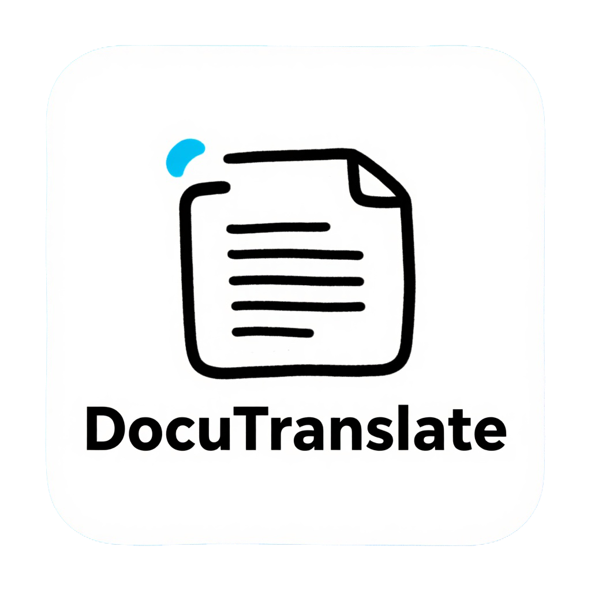

<p align="center">

</p>

<h1 align="center">DocuTranslate</h1>

<p align="center">
  <a href="https://github.com/xunbu/docutranslate/stargazers"></a>
  <a href="https://github.com/xunbu/docutranslate/releases"></a>
  <a href="https://pypi.org/project/docutranslate/"></a>
  <a href="https://www.python.org/"></a>
  <a href="./LICENSE"></a>
</p>

<p align="center">
  <a href="/README_ZH.md"><strong>简体中文</strong></a> / <a href="/README.md"><strong>English</strong></a> / <a href="/README_JP.md"><strong>日本語</strong></a> / <a href="/README_VI.md"><strong>Tiếng Việt</strong></a>
</p>

<p align="center">
  大規模言語モデル（LLM）に基づいた軽量なローカルファイル翻訳ツール
</p>

- ✅ **多形式対応**：`pdf`、`docx`、`xlsx`、`md`、`txt`、`json`、`epub`、`srt`、`ass`など、多様なファイルの翻訳に対応。
- ✅ **用語集自動生成**：用語のアライメント（統一）を実現するための用語集自動生成をサポート。
- ✅ **PDFの表・数式・コード認識**：`mineru`（オンラインまたはローカルデプロイ）を使用してPDFを解析し、学術論文によくある表、数式、コードの認識と翻訳を実現。
- ✅ **JSON翻訳**：JSONパス（`jsonpath-ng`構文）による翻訳対象値の指定をサポート。
- ✅ **Word/Excelの書式保持翻訳**：`docx`、`xlsx`ファイル（`doc`、`xls`は未対応）の書式を保持したまま翻訳可能。
- ✅ **マルチAIプラットフォーム対応**：ほぼ全てのAIプラットフォームに対応し、カスタムプロンプトによる高性能な並行AI翻訳を実現。
- ✅ **非同期サポート**：高性能なシナリオ向けに設計され、完全な非同期サポートを提供し、マルチタスク並列処理可能なサービスインターフェースを実装。
- ✅ **LAN・複数人利用対応**：LAN内での複数人同時利用をサポート。
- ✅ **インタラクティブなWeb画面**：すぐに使えるWeb UIとRESTful APIを提供し、統合と使用が容易。
- ✅ **軽量・マルチプラットフォーム対応のポータブルパッケージ**：40MB未満のWindows/Mac用ポータブルパッケージを提供。

> `pdf`を翻訳する際、まずMarkdownに変換されるため、元のレイアウトが**失われます**。レイアウトを重視するユーザーはご注意ください。

> QQ交流グループ：1047781902 1081128602

**UI画面**：


**論文翻訳**：


**小説翻訳**：


## 統合パッケージ

すぐに使い始めたいユーザー向けに、[GitHub Releases](https://github.com/xunbu/docutranslate/releases) で統合パッケージを提供しています。ダウンロードして解凍し、AIプラットフォームのAPIキーを入力するだけで使用を開始できます。

## クイックスタート

### pipを使用する場合

```bash
# 基本インストール
pip install docutranslate

# mcp拡張をインストール
pip install docutranslate[mcp]

docutranslate -i

#docutranslate -i --with-mcp
```

### uvを使用する場合

```bash
# 環境の初期化
uv init

# 基本インストール
uv add docutranslate

# mcp拡張をインストール
uv add docutranslate[mcp]

uv run --no-dev docutranslate -i

#uv run --no-dev docutranslate -i --with-mcp
```

### gitを使用する場合

```bash
# 環境の初期化
git clone https://github.com/xunbu/docutranslate.git

cd docutranslate

uv sync --no-dev
# uv sync --no-dev --extra mcp
# uv sync --no-dev --all-extras

```

### docker を使用する場合

```bash
docker run -d -p 8010:8010 xunbu/docutranslate:latest
# docker run -it -p 8010:8010 xunbu/docutranslate:latest
# docker run -it -p 8010:8010 xunbu/docutranslate:v1.5.4
```

## Web UI と API サービスの起動

使いやすくするために、DocuTranslate は機能豊富な Web インターフェースと RESTful API を提供しています。

**サービスの起動:**

```bash
  docutranslate -i                           (GUIを起動、デフォルトはローカルアクセス)
  docutranslate -i --host 0.0.0.0            (LAN内の他のデバイスからのアクセスを許可)
  docutranslate -i -p 8081                   (ポート番号を指定)
  docutranslate -i --cors                    (デフォルトのCORS設定を有効化)
  docutranslate -i --with-mcp                (GUIを起動し、MCP SSEエンドポイントを有効化、キューとポートを共有)
  docutranslate --mcp                         (MCPサーバーを起動、stdioモード)
  docutranslate --mcp --transport sse         (MCPサーバーを起動、SSEモード)
  docutranslate --mcp --transport sse --mcp-host MCP_HOST   --mcp-port MCP_PORT  (MCPサーバーを起動、SSEモード)
  docutranslate --mcp --transport streamable-http  (MCPサーバーを起動、Streamable HTTPモード)
```

- **インタラクティブ画面**: サービス起動後、ブラウザで `http://127.0.0.1:8010` (または指定したポート) にアクセスしてください。
- **API ドキュメント**: 完全な API ドキュメント (Swagger UI) は `http://127.0.0.1:8010/docs` にあります。
- MCP: SSEサービスエンドポイントは `http://127.0.0.1:8010/mcp/sse` (--with-mcpで起動) または `http://127.0.0.1:8000/mcp/sse` (--mcpで起動)

## MCP 設定

DocuTranslate は MCP（Model Context Protocol）サーバーとして使用できます。詳細なドキュメントについては、[MCP ドキュメント](./docutranslate/mcp/README.md)を参照してください。

### サポートされている環境変数

| 環境変数 | 説明 | 必須 |
|---------|------|------|
| `DOCUTRANSLATE_API_KEY` | AI プラットフォーム API キー | はい |
| `DOCUTRANSLATE_BASE_URL` | AI プラットフォームベース URL | はい |
| `DOCUTRANSLATE_MODEL_ID` | モデル ID | はい |
| `DOCUTRANSLATE_TO_LANG` | ターゲット言語（デフォルト: Chinese） | いいえ |
| `DOCUTRANSLATE_CONCURRENT` | 同時リクエスト数（デフォルト: 10） | いいえ |
| `DOCUTRANSLATE_CONVERT_ENGINE` | PDF 変換エンジン | いいえ |
| `DOCUTRANSLATE_MINERU_TOKEN` | MinerU API トークン | いいえ |

### uvx 設定（インストール不要）

```json
{
  "mcpServers": {
    "docutranslate": {
      "command": "uvx",
      "args": ["--from", "docutranslate[mcp]", "docutranslate", "--mcp"],
      "env": {
        "DOCUTRANSLATE_API_KEY": "sk-xxxxxx",
        "DOCUTRANSLATE_BASE_URL": "https://api.openai.com/v1",
        "DOCUTRANSLATE_MODEL_ID": "gpt-4o",
        "DOCUTRANSLATE_TO_LANG": "Chinese",
        "DOCUTRANSLATE_CONCURRENT": "10",
        "DOCUTRANSLATE_CONVERT_ENGINE": "mineru",
        "DOCUTRANSLATE_MINERU_TOKEN": "your-mineru-token"
      }
    }
  }
}
```

### SSE モード設定

まず、SSE モードで MCP サーバーを起動します：

```bash
docutranslate --mcp --transport sse --mcp-host 127.0.0.1 --mcp-port 8000
```

次に、クライアントで SSE エンドポイントを設定します：`http://127.0.0.1:8000/mcp/sse`

## 使用方法

### シンプルな Client SDK の使用 (推奨)

翻訳を始める最も簡単な方法は `Client` クラスを使用することです。これはシンプルで直感的な API を提供します：

```python
from docutranslate.sdk import Client

# AI プラットフォームの設定でクライアントを初期化
client = Client(
    api_key="YOUR_OPENAI_API_KEY",  # またはその他の AI プラットフォーム API キー
    base_url="https://api.openai.com/v1/",
    model_id="gpt-4o",
    to_lang="中文",
    concurrent=10,  # 同時リクエスト数
)

# 例 1: テキストファイルを翻訳 (PDF 解析エンジンが不要)
result = client.translate("path/to/your/document.txt")
print(f"翻訳完了！保存先: {result.save()}")

# 例 2: PDF ファイルを翻訳 (mineru_token またはローカルデプロイが必要)
# 方式 A: オンライン MinerU を使用 (token が必要: https://mineru.net/apiManage/token)
result = client.translate(
    "path/to/your/document.pdf",
    convert_engine="mineru",
    mineru_token="YOUR_MINERU_TOKEN",  # MinerU Token に置き換える
    formula_ocr=True,  # 数式認識を有効化
)
result.save(fmt="html")

# 方式 B: ローカルデプロイの MinerU を使用 (イントラネット/オフライン環境推奨)
# ローカル MinerU サービスを先に起動してください, 参考: https://github.com/opendatalab/MinerU
result = client.translate(
    "path/to/your/document.pdf",
    convert_engine="mineru_deploy",
    mineru_deploy_base_url="http://127.0.0.1:8000",  # ローカル MinerU アドレス
    mineru_deploy_backend="hybrid-auto-engine",  # バックエンドタイプ
)
result.save(fmt="markdown")

# 例 3: Docx ファイルを翻訳 (書式保持)
result = client.translate(
    "path/to/your/document.docx",
    insert_mode="replace",  # replace/append/prepend
)
result.save(fmt="docx")  # docx フォーマットで保存

# 例 4: Base64 エンコード文字列としてエクスポート (API 転送用)
base64_content = result.export(fmt="html")
print(f"エクスポートコンテンツ長さ: {len(base64_content)}")

# 基盤のワークフローにアクセスして高度な操作を行うことも可能
# workflow = result.workflow
```

**Client の機能:**
- **自動検出**: ファイル类型を自動検出し、適切なワークフローを選択
- **柔軟な設定**: 翻訳呼び出しごとにデフォルト設定を上書き可能
- **複数の出力オプション**: ディスクに保存または Base64 文字列としてエクスポート
- **非同期サポート**: 同時翻訳タスクには `translate_async()` を使用

#### Client SDK パラメータ一覧

| パラメータ | タイプ | デフォルト | 説明 |
|:---|:---|:---|:---|
| **api_key** | `str` | - | AI プラットフォーム API キー |
| **base_url** | `str` | - | AI プラットフォームベース URL（例: `https://api.openai.com/v1/`） |
| **model_id** | `str` | - | 翻訳に使用するモデル ID |
| **to_lang** | `str` | - | ターゲット言語（例: `"中文"`、`"English"`、`"日本語"`） |
| **concurrent** | `int` | 10 | 同時 LLM リクエスト数 |
| **convert_engine** | `str` | `"mineru"` | PDF 解析エンジン: `"mineru"`、`"mineru_deploy"` |
| **md2docx_engine** | `str` | `"auto"` | Markdown から Docx への変換エンジン: `"python"`（純Python）、`"pandoc"`（Pandoc を使用）、`"auto"`（インストールされていればPandocを使用，否则はPython）、`null`（docxを生成しない） |
| **mineru_deploy_base_url** | `str` | - | ローカル minerU API アドレス（`convert_engine="mineru_deploy"` の場合） |
| **mineru_deploy_parse_method** | `str` | `"auto"` | ローカル minerU 解析方法: `"auto"`, `"txt"`, `"ocr"` |
| **mineru_deploy_table_enable** | `bool` | `True` | ローカル minerU テーブル認識を有効化するか |
| **mineru_token** | `str` | - | minerU API Token（オンライン minerU 使用時） |
| **skip_translate** | `bool` | `False` | 翻訳をスキップしてドキュメントのみを解析 |
| **output_dir** | `str` | `"./output"` | `save()` メソッドのデフォルト出力ディレクトリ |
| **chunk_size** | `int` | 3000 | LLM 処理のテキストチャンクサイズ |
| **temperature** | `float` | 0.3 | LLM 温度パラメータ |
| **timeout** | `int` | 60 | リクエストタイムアウト（秒） |
| **retry** | `int` | 3 | 失敗時の再試行回数 |
| **provider** | `str` | `"auto"` | AI プロバイダータイプ（auto、openai、azure など） |
| **force_json** | `bool` | `False` | 強制 JSON 出力モード |
| **rpm** | `int` | - | 1分あたりのリクエスト数制限 |
| **tpm** | `int` | - | 1分あたりのトークン数制限 |
| **extra_body** | `str` | - | JSON文字列形式の追加リクエストボディパラメータ、APIリクエストにマージされます |
| **thinking** | `str` | `"auto"` | 思考モード: `"auto"`、`"none"`、`"block"` |
| **custom_prompt** | `str` | - | カスタム翻訳プロンプト |
| **system_proxy_enable** | `bool` | `False` | システムプロキシを有効化 |
| **insert_mode** | `str` | `"replace"` | Docx/Xlsx/Txt 挿入モード: `"replace"`、`"append"`、`"prepend"` |
| **separator** | `str` | `"\n"` | append/prepend モードのテキスト区切り文字 |
| **segment_mode** | `str` | `"line"` | セグメンテーションモード: `"line"`、`"paragraph"`、`"none"` |
| **translate_regions** | `list` | - | Excel 翻訳領域（例: `"Sheet1!A1:B10"`） |
| **model_version** | `str` | `"vlm"` | MinerU モデルバージョン: `"pipeline"`、`"vlm"` |
| **formula_ocr** | `bool` | `True` | PDF 解析で数式 OCR を有効化 |
| **code_ocr** | `bool` | `True` | PDF 解析でコード OCR を有効化 |
| **mineru_deploy_backend** | `str` | `"hybrid-auto-engine"` | MinerU ローカルバックエンド: `"pipeline"`、`"vlm-auto-engine"`、`"vlm-http-client"`、`"hybrid-auto-engine"`、`"hybrid-http-client"` |
| **mineru_deploy_formula_enable** | `bool` | `True` | ローカル MinerU で数式認識を有効化 |
| **mineru_deploy_start_page_id** | `int` | 0 | ローカル MinerU 解析開始ページ ID |
| **mineru_deploy_end_page_id** | `int` | 99999 | ローカル MinerU 解析終了ページ ID |
| **mineru_deploy_lang_list** | `list` | - | ローカル MinerU 解析言語リスト |
| **mineru_deploy_server_url** | `str` | - | MinerU ローカルサーバー URL |
| **json_paths** | `list` | - | JSON 翻訳用の JSONPath 式（例: `"$.data.*"`） |
| **glossary_generate_enable** | `bool` | - | 用語集自動生成を有効化 |
| **glossary_dict** | `dict` | - | 用語集辞書（例: `{"Jobs": "Steve Jobs"}`） |
| **glossary_agent_config** | `dict` | - | 用語集エージェント設定 |

#### Result メソッド一覧

| メソッド | パラメータ | 説明 |
|:---|:---|:---|
| **save()** | `output_dir`, `name`, `fmt` | 翻訳結果をディスクに保存 |
| **export()** | `fmt` | Base64 エンコード文字列としてエクスポート |
| **supported_formats** | - | サポートされている出力フォーマット一覧を取得 |
| **workflow** | - | 基盤のワークフローオブジェクトにアクセス |

```python
import asyncio
from docutranslate.sdk import Client

async def translate_multiple():
    client = Client(
        api_key="YOUR_API_KEY",
        base_url="https://api.openai.com/v1/",
        model_id="gpt-4o",
        to_lang="中文",
    )

    # 複数のファイルを同時に翻訳
    files = ["doc1.pdf", "doc2.docx", "notes.txt"]
    results = await asyncio.gather(
        *[client.translate_async(f) for f in files]
    )

    for r in results:
        print(f"保存先: {r.save()}")

asyncio.run(translate_multiple())
```

### Workflow API の使用（高度な制御）

より精细な制御が必要な場合は、Workflow API を直接使用してください。すべてのワークフローは同じパターンに従います：

```python
# パターン:
# 1. TranslatorConfig を作成（LLM設定）
# 2. WorkflowConfig を作成（ワークフロー設定）
# 3. Workflow インスタンスを作成
# 4. workflow.read_path(ファイル)
# 5. await workflow.translate_async()
# 6. workflow.save_as_*(name=...) または export_to_*(...)
```
#### 利用可能なワークフローと出力メソッド

| ワークフロー | 入力形式 | save_as_* | export_to_* | 主要設定オプション |
|:---|:---|:---|:---|:---|
| **MarkdownBasedWorkflow** | `.pdf`, `.docx`, `.md`, `.png`, `.jpg` | `html`, `markdown`, `markdown_zip`, `docx` | `html`, `markdown`, `markdown_zip`, `docx` | `convert_engine`, `md2docx_engine`, `translator_config` |
| **TXTWorkflow** | `.txt` | `txt`, `html` | `txt`, `html` | `translator_config` |
| **JsonWorkflow** | `.json` | `json`, `html` | `json`, `html` | `translator_config`, `json_paths` |
| **DocxWorkflow** | `.docx` | `docx`, `html` | `docx`, `html` | `translator_config`, `insert_mode` |
| **XlsxWorkflow** | `.xlsx`, `.csv` | `xlsx`, `html` | `xlsx`, `html` | `translator_config`, `insert_mode` |
| **SrtWorkflow** | `.srt` | `srt`, `html` | `srt`, `html` | `translator_config` |
| **EpubWorkflow** | `.epub` | `epub`, `html` | `epub`, `html` | `translator_config`, `insert_mode` |
| **HtmlWorkflow** | `.html`, `.htm` | `html` | `html` | `translator_config`, `insert_mode` |
| **AssWorkflow** | `.ass` | `ass`, `html` | `ass`, `html` | `translator_config` |

#### 主要設定オプション

**共通 TranslatorConfig オプション:**

| オプション | タイプ | デフォルト | 説明 |
|:---|:---|:---|:---|
| `base_url` | `str` | - | AI プラットフォームベース URL |
| `api_key` | `str` | - | AI プラットフォーム API キー |
| `model_id` | `str` | - | モデル ID |
| `to_lang` | `str` | - | ターゲット言語 |
| `chunk_size` | `int` | 3000 | テキストチャンクサイズ |
| `concurrent` | `int` | 10 | 同時リクエスト数 |
| `temperature` | `float` | 0.3 | LLM 温度 |
| `timeout` | `int` | 60 | リクエストタイムアウト（秒） |
| `retry` | `int` | 3 | 再試行回数 |

**フォーマット固有オプション:**

| オプション | 適用ワークフロー | 説明 |
|:---|:---|:---|
| `insert_mode` | Docx, Xlsx, Html, Epub | `"replace"`（デフォルト）, `"append"`, `"prepend"` |
| `json_paths` | Json | JSONPath 式（例: `["$.*", "$.name"]`） |
| `separator` | Docx, Xlsx, Html, Epub | append/prepend モードのテキスト区切り文字 |
| `convert_engine` | MarkdownBased | `"mineru"`（デフォルト）, `"mineru_deploy"` |

#### 例 1: PDFファイルの翻訳 (`MarkdownBasedWorkflow` を使用)

これが最も一般的なユースケースです。`minerU` エンジンを使用して PDF を Markdown に変換し、その後 LLM を使用して翻訳します。ここでは非同期方式を例にします。

```python
import asyncio
from docutranslate.workflow.md_based_workflow import MarkdownBasedWorkflow, MarkdownBasedWorkflowConfig
from docutranslate.converter.x2md.converter_mineru import ConverterMineruConfig
from docutranslate.translator.ai_translator.md_translator import MDTranslatorConfig
from docutranslate.exporter.md.md2html_exporter import MD2HTMLExporterConfig


async def main():
    # 1. 翻訳機設定の構築
    translator_config = MDTranslatorConfig(
        base_url="https://open.bigmodel.cn/api/paas/v4",  # AIプラットフォーム Base URL
        api_key="YOUR_ZHIPU_API_KEY",  # AIプラットフォーム API Key
        model_id="glm-4-air",  # モデル ID
        to_lang="English",  # ターゲット言語
        chunk_size=3000,  # テキスト分割サイズ
        concurrent=10,  # 同時並行数
        # glossary_generate_enable=True, # 用語集自動生成を有効化
        # glossary_dict={"Jobs":"ジョブズ"}, # 用語集を渡す
        # system_proxy_enable=True,# システムプロキシを有効化
    )

    # 2. コンバータ設定の構築 (minerUを使用)
    converter_config = ConverterMineruConfig(
        mineru_token="YOUR_MINERU_TOKEN",  # あなたの minerU Token
        formula_ocr=True  # 数式認識を有効化
    )

    # 3. メインワークフロー設定の構築
    workflow_config = MarkdownBasedWorkflowConfig(
        convert_engine="mineru",  # 解析エンジンを指定
        converter_config=converter_config,  # コンバータ設定を渡す
        translator_config=translator_config,  # 翻訳機設定を渡す
        html_exporter_config=MD2HTMLExporterConfig(cdn=True)  # HTMLエクスポート設定
    )

    # 4. ワークフローのインスタンス化
    workflow = MarkdownBasedWorkflow(config=workflow_config)

    # 5. ファイルの読み込みと翻訳実行
    print("ファイルの読み込みと翻訳を開始します...")
    workflow.read_path("path/to/your/document.pdf")
    await workflow.translate_async()
    # または同期方式を使用
    # workflow.translate()
    print("翻訳完了！")

    # 6. 結果の保存
    workflow.save_as_html(name="translated_document.html")
    workflow.save_as_markdown_zip(name="translated_document.zip")
    workflow.save_as_markdown(name="translated_document.md")  # 画像埋め込みMarkdown
    print("ファイルは ./output フォルダに保存されました。")

    # またはコンテンツ文字列を直接取得
    html_content = workflow.export_to_html()
    html_content = workflow.export_to_markdown()
    # print(html_content)


if __name__ == "__main__":
    asyncio.run(main())
```

### その他のワークフロー

すべてのワークフローは同じパターンに従います。対応する設定とワークフローをインポートして設定します：

```python
# TXT: from docutranslate.workflow.txt_workflow import TXTWorkflow, TXTWorkflowConfig
# JSON: from docutranslate.workflow.json_workflow import JsonWorkflow, JsonWorkflowConfig
# DOCX: from docutranslate.workflow.docx_workflow import DocxWorkflow, DocxWorkflowConfig
# XLSX: from docutranslate.workflow.xlsx_workflow import XlsxWorkflow, XlsxWorkflowConfig
# EPUB: from docutranslate.workflow.epub_workflow import EpubWorkflow, EpubWorkflowConfig
# HTML: from docutranslate.workflow.html_workflow import HtmlWorkflow, HtmlWorkflowConfig
# SRT:  from docutranslate.workflow.srt_workflow import SrtWorkflow, SrtWorkflowConfig
# ASS:   from docutranslate.workflow.ass_workflow import AssWorkflow, AssWorkflowConfig
```

主な設定オプション：
- **insert_mode**: `"replace"`, `"append"`, `"prepend"` (docx/xlsx/html/epub 用)
- **json_paths**: JSON 翻訳用の JSONPath 式 (例: `["$.*", "$.name"]`)
- **separator**: `"append"` / `"prepend"` モード用のテキスト区切り文字

## 前提条件と設定詳細

### 1. 大規模モデル API Key の取得

翻訳機能は大規模言語モデル（LLM）に依存しており、対応するAIプラットフォームから `base_url`、`api_key`、`model_id` を取得する必要があります。

> 推奨モデル：Volcengineの `doubao-seed-1-6-flash`、`doubao-seed-1-6` シリーズ、Zhipuの `glm-4-flash`、Alibaba Cloudの `qwen-plus`、`qwen-flash`、DeepSeekの `deepseek-chat` など。

> [302.AI](https://share.302.ai/BgRLAe)👈このリンクから登録すると、1ドルの無料クレジットがもらえます。

| プラットフォーム名 | API Keyの取得 | baseurl |
|:---|:---|:---|
| ollama | | http://127.0.0.1:11434/v1 |
| lm studio | | http://127.0.0.1:1234/v1 |
| 302.AI | [取得はこちら](https://share.302.ai/BgRLAe) | https://api.302.ai/v1 |
| openrouter | [取得はこちら](https://openrouter.ai/settings/keys) | https://openrouter.ai/api/v1 |
| openai | [取得はこちら](https://platform.openai.com/api-keys) | https://api.openai.com/v1/ |
| gemini | [取得はこちら](https://aistudio.google.com/u/0/apikey) | https://generativelanguage.googleapis.com/v1beta/openai/ |
| deepseek | [取得はこちら](https://platform.deepseek.com/api_keys) | https://api.deepseek.com/v1 |
| 智譜ai (Zhipu) | [取得はこちら](https://open.bigmodel.cn/usercenter/apikeys) | https://open.bigmodel.cn/api/paas/v4 |
| テンセント混元 | [取得はこちら](https://console.cloud.tencent.com/hunyuan/api-key) | https://api.hunyuan.cloud.tencent.com/v1 |
| アリババ百錬 | [取得はこちら](https://bailian.console.aliyun.com/?tab=model#/api-key) | https://dashscope.aliyuncs.com/compatible-mode/v1 |
| 火山引擎 (Volcengine) | [取得はこちら](https://console.volcengine.com/ark/region:ark+cn-beijing/apiKey?apikey=%7B%7D) | https://ark.cn-beijing.volces.com/api/v3 |
| SiliconFlow | [取得はこちら](https://cloud.siliconflow.cn/account/ak) | https://api.siliconflow.cn/v1 |
| DMXAPI | [取得はこちら](https://www.dmxapi.cn/token) | https://www.dmxapi.cn/v1 |
| 聚光AI | [取得はこちら](https://ai.juguang.chat/console/token) | https://ai.juguang.chat/v1 |

### 2. PDF解析エンジン（PDF翻訳が不要な場合は無視して構いません）

### 2.1 minerU Token の取得 (オンラインPDF解析、無料、推奨)

ドキュメント解析エンジンとして `mineru` を選択する場合（`convert_engine="mineru"`）、無料の Token を申請する必要があります。

1. [minerU 公式サイト](https://mineru.net/apiManage/docs) にアクセスし、登録して API を申請します。
2. [API Token 管理画面](https://mineru.net/apiManage/token) で新しい API Token を作成します。

> **注意**: minerU Token の有効期限は14日間です。期限切れ後は再作成してください。

### 2.2. ローカルデプロイ MinerU サービス

オフラインまたはイントラネット環境では、ローカルデプロイの `minerU` を使用できます。`mineru_deploy_base_url` に minerU API アドレスを設定してください。

**Client SDK:**
```python
from docutranslate.sdk import Client

client = Client(
    api_key="YOUR_LLM_API_KEY",
    model_id="llama3",
    to_lang="中文",
    convert_engine="mineru_deploy",
    mineru_deploy_base_url="http://127.0.0.1:8000",  # minerU API アドレス
)
result = client.translate("document.pdf")
result.save(fmt="markdown")
```

## FAQ

**Q: 翻訳結果が原文のまま？**
A: ログを確認。通常、AIプラットフォーム残高不足またはネットワーク問題。

**Q: 8010ポート使用中？**
A: `docutranslate -i -p 8011` または `DOCUTRANSLATE_PORT=8011`。

**Q: スキャンPDF対応？**
A: はい。`mineru` エンジンのOCR機能を使用。

**Q: イントラネット/オフライン使用？**
A: 可能 ローカル翻訳はローカルLLM（Ollama/LM Studio/VLLMなど）をデプロイすることで実現できます。ローカルでPDFを解析する必要がある場合は、ローカルデプロイMinerUも必要です。

**Q: PDFキャッシュ機構？**
A: `MarkdownBasedWorkflow` がメモリ内に解析結果をキャッシュ（最近10件）。`DOCUTRANSLATE_CACHE_NUM` で変更可。

**Q: プロキシ有効化？**
A: TranslatorConfig で `system_proxy_enable=True` を設定。

## Star History

<a href="https://www.star-history.com/#xunbu/docutranslate&Date">
 <picture>
   <source media="(prefers-color-scheme: dark)" srcset="https://api.star-history.com/svg?repos=xunbu/docutranslate&type=Date&theme=dark" />
   <source media="(prefers-color-scheme: light)" srcset="https://api.star-history.com/svg?repos=xunbu/docutranslate&type=Date" />
   
 </picture>
</a>

## 寄付・サポート

著者をサポートしてくださる方は、備考欄に理由を書いていただけると嬉しいです。

<p align="center">
  
</p>
